# Eş Zamanlı Sipariş ve Stok Yönetimi Sistemi

Hızlı ve güvenli bir sipariş yönetimi deneyimi sunan web uygulaması.Flask ile geliştirildi.

---

## ✨ Öne Çıkan Özellikler

### <i class="bi bi-person-badge"></i> Müşteri Yönetimi
* **Kayıt & Giriş:** Email/şifre ile kayıt ve giriş. Şifreler hashlenerek korunur.
* **Email Doğrulama:** Kayıt sonrası email onayı ile hesap güvenliği.
* **🔒 İsteğe Bağlı 2FA:** Google Authenticator ile ekstra güvenlik katmanı. Profil veya kayıt sırasında kolayca etkinleştirme/devre dışı bırakma.
* **Profil Merkezi:** Kullanıcı bilgileri, bakiye, harcama geçmişi tek ekranda. Şifre değiştirme ve 2FA yönetimi.
* **Şifre Sıfırlama:** "Şifremi Unuttum?" özelliği ile email üzerinden kolay şifre sıfırlama.
* **Yönetici Kontrolü:** Müşteri ekleme, silme ve bütçe yönetimi.
* **Tema Seçimi:** Açık ve Koyu tema arasında tek tıkla geçiş. Seçiminiz hatırlanır.
### <i class="bi bi-box-seam"></i> Ürün Yönetimi
* **Görsel Stok Takibi:** Ürünler; isim, fiyat ve stok durumu (progress bar ile) listelenir.
* **Stok Güncelleme:** Yönetici, interaktif slider ile stokları anında artırıp azaltabilir.
* **Ürün Ekleme/Silme:** Yönetici arayüzünden hızlıca ürün ekleme ve silme işlemleri.
* **Anlık Güncelleme:** Stok değişiklikleri sipariş formlarına anında yansır (AJAX).

### <i class="bi bi-cart4"></i> Sipariş Yönetimi
* **Sipariş Oluşturma:** Müşteriler veya yöneticiler tarafından, güncel stok/fiyat bilgisiyle kolayca sipariş verilebilir.
* **Detaylı Listeleme:** Siparişler; ID, müşteri, ürün, miktar, toplam tutar ve durum bilgileriyle (renk kodlu) listelenir.
* **Durum Takibi:** Siparişlerin `Pending` 🟡, `Approved` 🟢 veya `Rejected` 🔴 durumları anlık olarak takip edilebilir.
* **Akıllı İşleme:** Arka planda çalışan thread'ler, müşteri tipi (Premium ⭐ öncelikli) ve bekleme süresine göre dinamik öncelik hesaplayarak siparişleri adil ve verimli bir şekilde işler (stok/bütçe kontrolü dahil).
* **Gerçek Zamanlı Güncelleme:** Sipariş tablosu AJAX ile periyodik olarak güncellenerek en son durum yansıtılır.
* **Test Sistemi:** Yönetici tek tuşla rastgele toplu siparişler oluşturarak sistemi test edebilir.

### <i class="bi bi-clipboard-data"></i> Loglama ve İzleme
* **Detaylı Kayıt:** Sistemdeki tüm önemli olaylar (sipariş, kullanıcı işlemleri, hatalar vb.) titizlikle loglanır.
* **Yönetici Log Paneli:** Loglar zaman damgasıyla listelenir. Checkbox'lar ile log türüne göre dinamik filtreleme imkanı.

### <i class="bi bi-shield-check"></i> Güvenlik Özellikleri
* **Güvenli Şifreleme:** Şifreler modern hash algoritmaları ile korunur.
* **Zaman Damgalı Tokenlar:** Email onayı ve şifre sıfırlama için güvenli, süreli tokenlar kullanılır.
* **2FA Desteği:** Google Authenticator ile TOTP tabanlı ek güvenlik.
* **Eş Zamanlılık Kontrolü:** `Lock` ve `Semaphore` mekanizmaları ile veri bütünlüğü korunur.
* **Yetkilendirme:** Yönetici fonksiyonlarına erişim rol bazlı kontrol edilir.

### <i class="bi bi-speedometer2"></i> Yönetici Paneli
* **Dashboard:** Sistem istatistikleri (müşteri, ürün, sipariş sayıları, toplam gelir vb.) tek bir ekranda.
* **Veri Görselleştirme:** Sipariş durumu dağılımı gibi önemli metrikler Chart.js ile interaktif grafiklerle sunulur.

---

## 🛠️ Kullanılan Teknolojiler

* **Backend:** Python, Flask, Flask-PyMongo, Flask-Mail, PyOTP, itsdangerous, Werkzeug, threading
* **Frontend:** HTML5, CSS3, JavaScript, jQuery, Bootstrap 5, Chart.js
* **Veritabanı:** MongoDB

---

## 🚀 Kullanım Kılavuzu

1.  **Hesap Oluşturun:** "Kayıt Ol" sayfasını kullanın, emailinizi doğrulayın.
2.  **Giriş Yapın:** Email ve şifrenizle (varsa 2FA koduyla) giriş yapın.
3.  **Panelleri Keşfedin:** Navigasyon menüsünü kullanarak Müşteri, Ürün, Sipariş, Log ve Yönetici panellerine erişin.
4.  **İşlemleri Gerçekleştirin:** Sipariş verin, profilinizi güncelleyin, (yöneticiyseniz) ürün/müşteri/stok yönetimi yapın.
5.  **Temayı Değiştirin:** Sağ alttaki buton ile açık/koyu tema arasında geçiş yapın.

---

## 📸 Uygulama Görselleri

*(Uygulamanın temel ekranlarından bazıları aşağıdadır.)*

**Giriş ve Kullanıcı İşlemleri:**

| Kayıt Ekranı                                       | Giriş Ekranı                                       |                   Şifremi Unuttum                    | Şifre Değiştirme                                     |
| :------------------------------------------------: | :------------------------------------------------: |:----------------------------------------------------:| :-------------------------------------------------: |
| 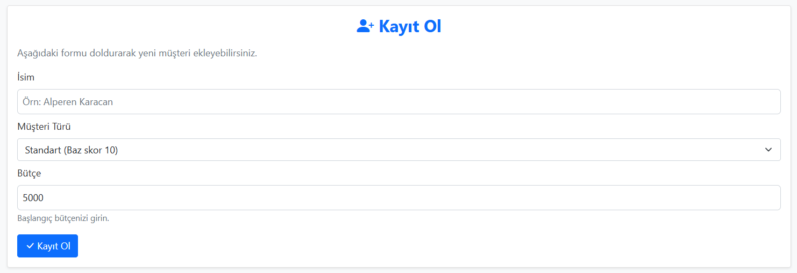                | 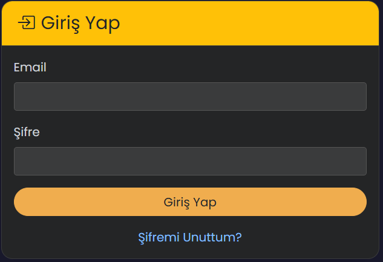               |    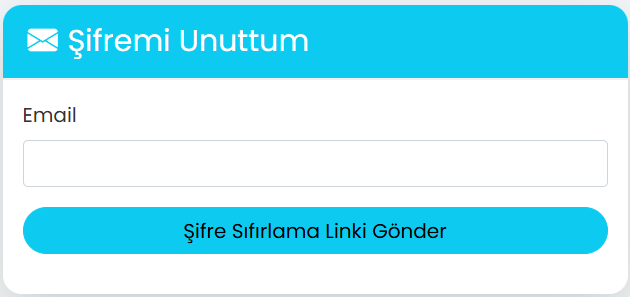     | 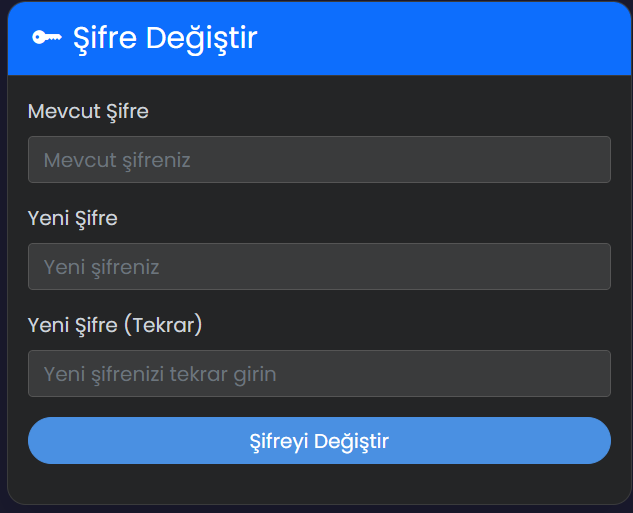      |
| _Kullanıcı dostu kayıt formu (2FA seçeneği ile)._ | _Güvenli giriş ekranı ve şifre kurtarma linki._ | _Email adresine şifre sıfırlama bağlantı gönderimi._ | _Profil üzerinden güvenli şifre güncelleme._ |

**Yönetim Panelleri:**

| Müşteri Paneli                                      | Ürün Paneli                                           | Sipariş Paneli                                        |
| :-------------------------------------------------: | :----------------------------------------------------: | :---------------------------------------------------: |
| 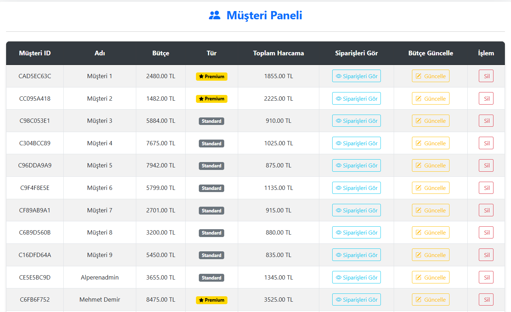         | 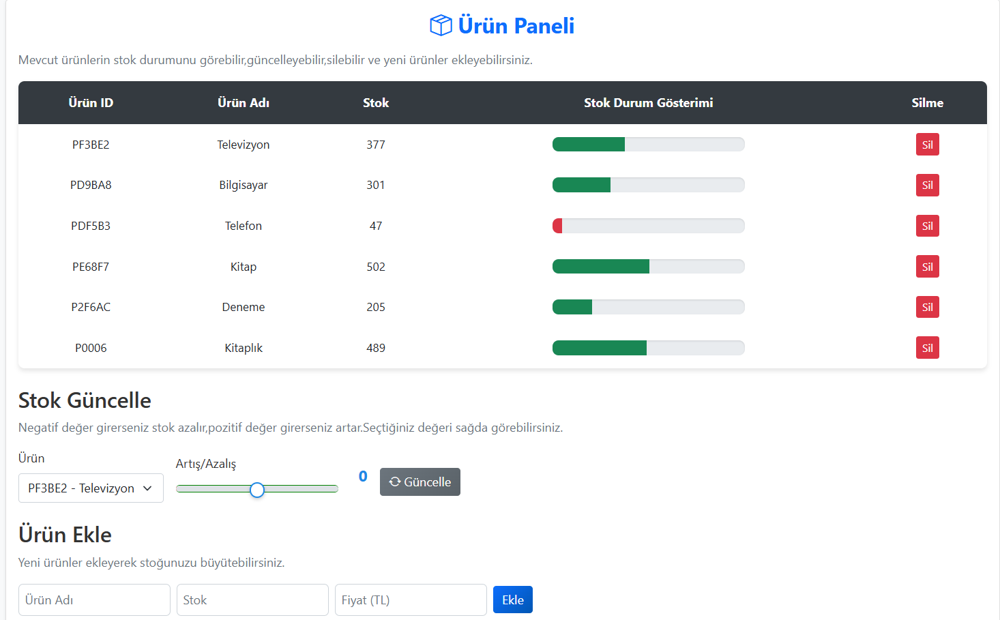                  | 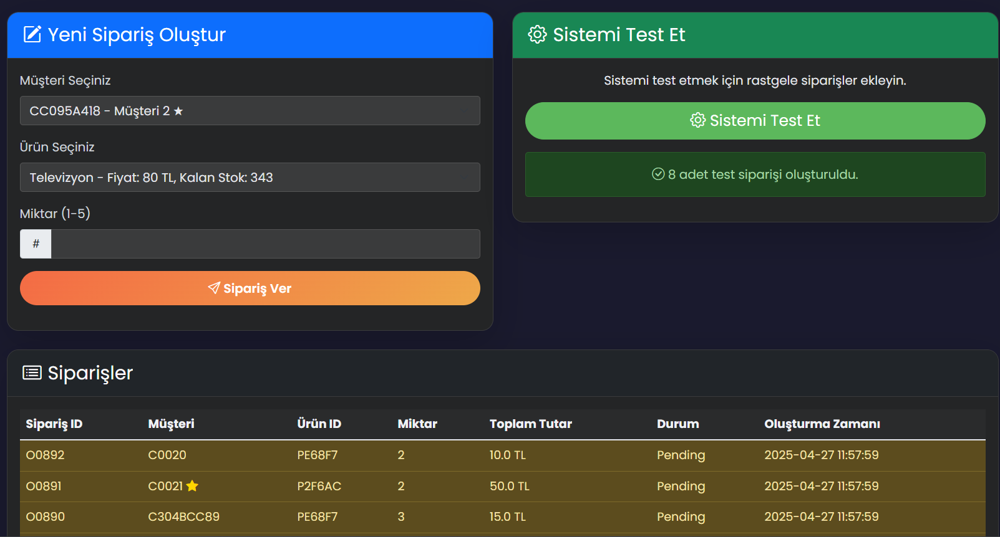          |
| _Müşteriler listelenir (Premium ⭐ vurgulu)._     | _Ürünler stok durumuyla listelenir, stok güncellenir._ | _Siparişler durum renkleriyle ve anlık güncellenir._ |

| Sipariş Verme                                          |                   Bütçe Güncelleme                    |                   Loglama Paneli                    |                   Yönetici Paneli                   |
| :----------------------------------------------------: |:-----------------------------------------------------:|:---------------------------------------------------:|:---------------------------------------------------:|
| 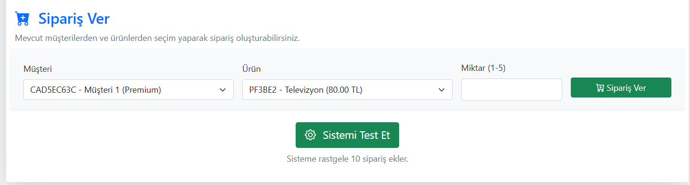              |     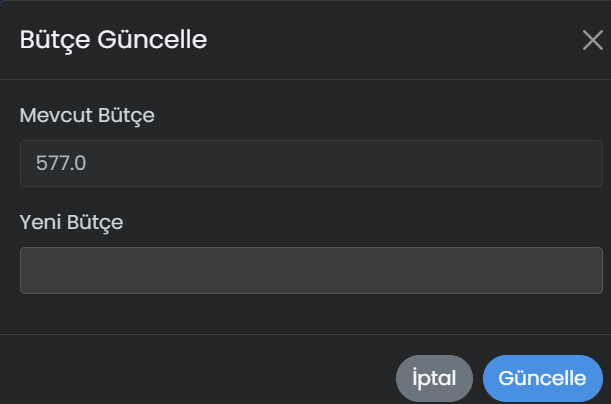     |       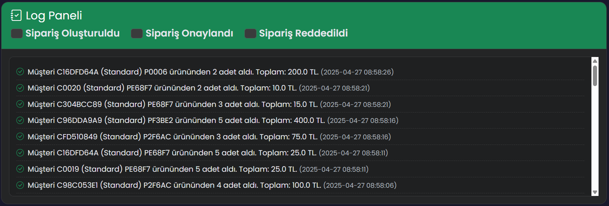       |    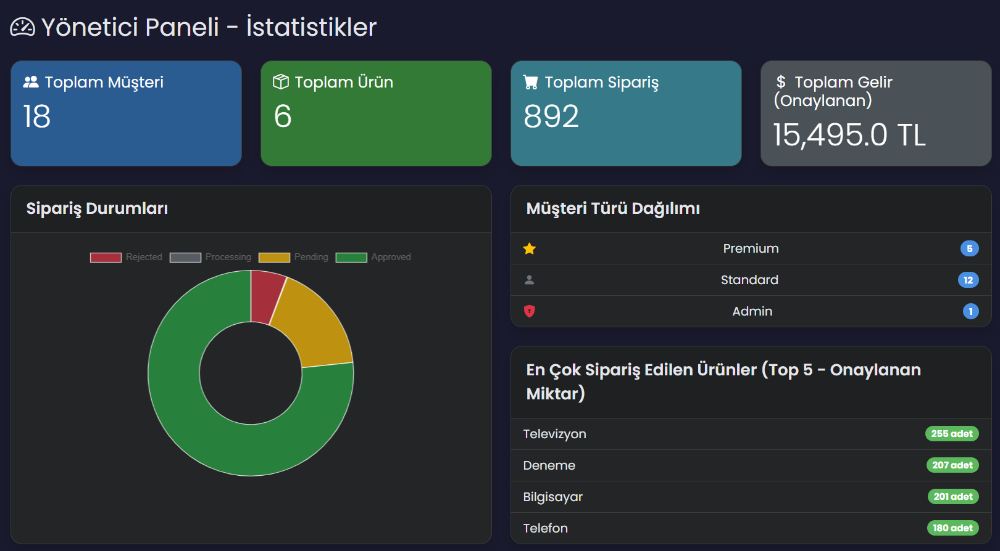    |
| _Sipariş verirken güncel stok/fiyat bilgisi görünür._ | _Yönetici kolayca müşteri bütçesini güncelleyebilir._ | _Loglar detaylı listelenir ve dinamik filtrelenir._ | _Sistem istatistikleri ve grafiklerle genel bakış._ |
