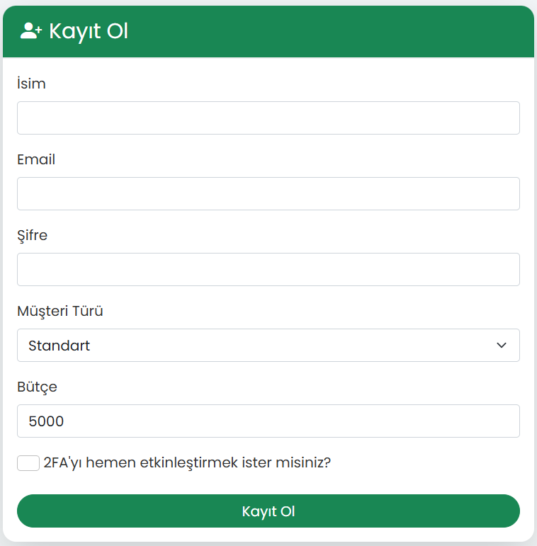

# Eş Zamanlı Sipariş ve Stok Yönetimi Sistemi

## İçindekiler

- [Genel Bakış](#genel-bakış)
- [Özellikler](#özellikler)
- [Kullanılan Teknolojiler](#kullanılan-teknolojiler)
- [Uygulama Görselleri](#uygulama-görselleri)
---

## Genel Bakış

Eş Zamanlı Sipariş ve Stok Yönetimi Sistemi, **müşteri**, **ürün** ve **sipariş yönetimi** süreçlerini daha hızlı ve güvenilir bir şekilde gerçekleştirmelerine yardımcı olan modern bir web uygulamasıdır. 

Sistem, farklı müşteri türlerini (Premium ve Standard) destekler ve **öncelik bazlı sipariş işleme mekanizması** ile en yüksek önceliğe sahip siparişleri işleme alır. Ayrıca, kullanıcı dostu bir arayüz ve detaylı loglama özelliği mevcuttur.

---

## Özellikler

### **Müşteri Yönetimi**
- Yeni müşteriler ekleme, silme ve düzenleme.
- Müşteri türüne göre farklı görünümler (Premium müşteriler yanında yıldız simgesi ile vurgulanır).
- Müşterilerin toplam harcamalarını ve kalan bütçelerini görüntüleme.

### **Ürün Yönetimi**
- Yeni ürünler ekleme, silme ve stok yönetimi.
- Ürün fiyatlarını ve mevcut stok durumlarını görsel bir tabloda listeleme.

### **Sipariş Yönetimi**
- Müşteriler için sipariş oluşturma.
- Siparişlerin birim fiyat ve toplam maliyet detaylarıyla listelenmesi.
- Siparişlerin **Pending**, **Approved** veya **Rejected** durumlarını takip etme.
- **Arka planda çalışan thread'ler** ile dinamik öncelik hesaplaması ve işleme.

### **Loglama ve İzleme**
- Gerçek zamanlı loglama ile tüm sistem olaylarının kaydını tutma.
- İşlemlerin neden başarılı veya başarısız olduğunu gösteren detaylı log paneli.

### **Kullanıcı Dostu Arayüz**
- Modern, şık ve responsive bir tasarım.
- Etkileşimli butonlar ve araçlarla zenginleştirilmiş kullanıcı deneyimi.

### **Sistem Testi**
- "Test Et" özelliği ile sisteme 10 adet rastgele sipariş ekleyerek canlı olarak test etme.

---

## Kullanılan Teknolojiler

- **Backend:**
  - **Python (Flask)**
  - **MongoDB**

- **Diğer:**
  - **Threading**: Arka planda sipariş işleme ve öncelik hesaplaması.

---

## Uygulama Görselleri

### **1. Müşteri Paneli**
Tüm müşterilerin listelendiği ve yönetildiği ana panel.

---

### **2. Müşteri Ekleme**
Yeni müşteri eklemek için kullanılan form.

---

### **3. Ürün Paneli**
Tüm ürünlerin listelendiği ve yönetildiği panel.

---

### **4. Sipariş Paneli**
Seçilen müşterinin siparişlerini görüntülediği panel.

---

### **5. Sipariş Verme**
Müşterilerden sipariş oluşturmak için kullanılan form.

---

### **6. Bütçe Güncelleme**
Müşteri bütçesini güncellemek için

---

### **7. Loglama Paneli**
Gerçek zamanlı sistem loglarının görüntülendiği panel.

---

### **8. Kayıt ve Giriş**
Kayıt olma ve giriş yapma ekranları.

---
